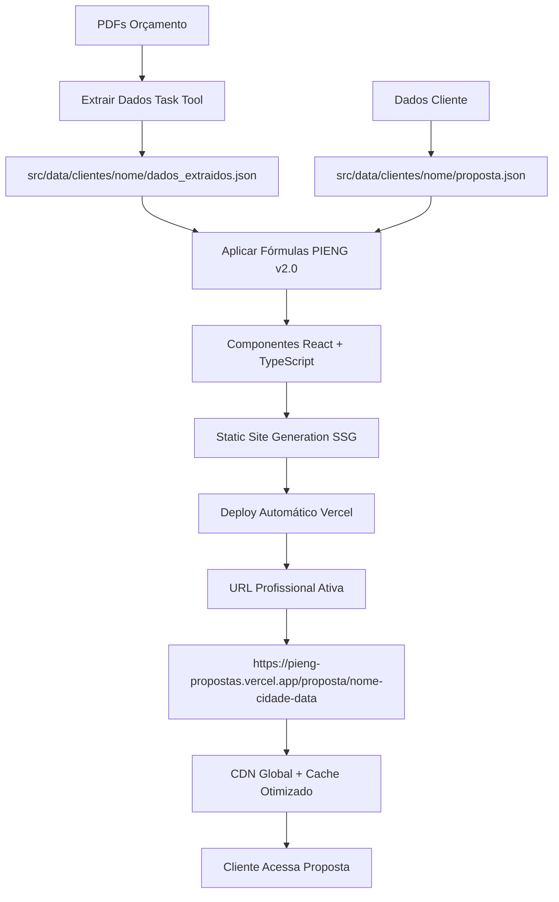

# 🌞 Sistema PIENG - Propostas Solares Modernas (Next.js + Vercel)

## 📋 Visão Geral

**SISTEMA MODERNIZADO - VERSÃO 2.0**

Sistema escalável desenvolvido em Next.js para gerar propostas solares seguras, sem exposição de dados sigilosos e otimizado para deploy no Vercel com URLs profissionais únicas.

## 🔒 Proteção de Dados Sigilosos

### ❌ Dados REMOVIDOS das propostas:
- **pdespesa** (margem de mão de obra)
- **pcusto** (preço de custo dos fornecedores)  
- **markup_percentual** (estratégia de precificação)
- **margem_lucro** (informações financeiras internas)
- **fornecedor_interno** (estratégias comerciais)

### ✅ Dados PÚBLICOS mantidos:
- Preços finais (PIX, 12x, 18x)
- Performance técnica (geração, payback, TIR)
- Especificações dos equipamentos
- Dados do cliente e cidade

## 📁 Nova Arquitetura (Next.js)

```
📦 Prompt_ORC_pieng/
├── 📄 package.json                    # Dependências Next.js
├── 📄 next.config.js                  # Configuração Next.js
├── 📄 tailwind.config.js              # Configuração Tailwind CSS
├── 📄 vercel.json                     # Deploy Vercel
├── 📄 README.md                       # Documentação principal
└── 📂 src/
    ├── 📂 components/                 # Componentes React modulares
    │   ├── 📄 Header.tsx
    │   ├── 📄 SystemCard.tsx
    │   ├── 📄 ComparisonTable.tsx
    │   ├── 📄 InsightsSection.tsx
    │   ├── 📄 CTASection.tsx
    │   └── 📄 Footer.tsx
    ├── 📂 pages/                      # Páginas Next.js
    │   ├── 📄 index.tsx               # Homepage
    │   ├── 📄 _app.tsx                # App configuration
    │   └── 📂 proposta/
    │       └── 📄 [slug].tsx          # Propostas dinâmicas
    ├── 📂 styles/
    │   └── 📄 globals.css             # Estilos Tailwind + PIENG
    ├── 📂 lib/
    │   ├── 📄 types.ts                # Tipos TypeScript
    │   └── 📄 propostaUtils.ts        # Utilitários
    └── 📂 data/clientes/              # Dados organizados por cliente
        └── 📂 [nome]/
            ├── 📄 proposta.json       # Dados da proposta
            └── 📄 dados_extraidos.json # Dados dos PDFs
```

### 🆚 Migração do Sistema Antigo

| Arquivo Antigo | Novo Local | Status |
|----------------|------------|---------|
| `template_proposta_pieng.html` | `src/pages/proposta/[slug].tsx` | ✅ Migrado |
| `styles.css` | `src/styles/globals.css` | ✅ Modernizado |
| `template_variables.json` | `src/lib/types.ts` | ✅ TypeScript |
| `Arisio/` | `src/data/clientes/arisio/` | ✅ Reorganizado |

## 🔧 Como Usar o Novo Sistema

### Passo 1: Setup Inicial
```bash
# Instalar dependências
npm install

# Iniciar desenvolvimento local
npm run dev

# Acessar: http://localhost:3000
```

### Passo 2: Criar Nova Proposta

1. **Extrair Dados dos PDFs**
```bash
# Use o Task tool para extrair dados dos PDFs
# Salvar em: src/data/clientes/[nome]/dados_extraidos.json
```

2. **Criar Dados da Proposta** (`src/data/clientes/[nome]/proposta.json`)
```json
{
  "cliente": {
    "nome": "Nome do Cliente",
    "cidade": "Cidade/Estado", 
    "consumoKwh": "450",
    "tipo": "Residencial",
    "hspLocal": "5.42"
  },
  "sistemas": [
    {
      "titulo": "Sistema Econômico",
      "potencia": "4,62 kWp",
      "especificacoes": ["14 módulos 330W", "1 inversor 5kW"],
      "precoPixDecimal": 15980.34,
      "payback": "19,6 meses",
      "isRecommended": true
    }
  ],
  "analise": {
    "paybackMin": "19,6",
    "economiaTarifa": "R$ 0,60"
  },
  "bannerUrgencia": "⚡ OFERTA ESPECIAL: VÁLIDA ATÉ 15/09/2024! ⚡"
}
```

### Passo 3: Deploy Automático
```bash
# Commit mudanças
git add .
git commit -m "Nova proposta: Cliente X"
git push

# Deploy automático no Vercel
# URL gerada: https://pieng-propostas.vercel.app/proposta/cliente-cidade-data
```

## 🎯 Sistema de Componentes (React/TypeScript)

### 🧩 Componentes Principais

**Header.tsx** - Cabeçalho com logo e dados do cliente
```typescript
interface HeaderProps {
  clienteNome: string;
  clienteCidade: string;
  clienteConsumo: string;
  clienteTipo: string;
}
```

**SystemCard.tsx** - Card individual de cada sistema
```typescript
interface SystemCardProps {
  titulo: string;
  potencia: string;
  especificacoes: string[];
  precoPixDecimal: number;
  payback: string;
  isRecommended?: boolean;
}
```

**ComparisonTable.tsx** - Tabela comparativa dos sistemas
**InsightsSection.tsx** - Análise estratégica personalizada  
**CTASection.tsx** - Botões de ação (WhatsApp, telefone, email)
**Footer.tsx** - Rodapé com disclaimers e contatos

### 🔄 Fluxo de Dados (Props vs Templates)

| Antigo (Templates) | Novo (React Props) |
|-------------------|-------------------|
| `{{CLIENTE_NOME}}` | `props.clienteNome` |
| `{{SISTEMA_1_PIX}}` | `sistema.precoPixDecimal` |
| `{{PAYBACK_MIN}}` | `insights.paybackMin` |
| `{{MELHOR_SISTEMA_PAYBACK}}` | `bestSystem.payback` |

## 🔄 Novo Processo de Geração (Automatizado)

1. **Coleta de Dados**
   - PDFs de orçamento → `src/data/clientes/[nome]/dados_extraidos.json`
   - Dados do cliente → `src/data/clientes/[nome]/proposta.json`

2. **Cálculos Seguros (Mantidos)**
   - Aplicar fórmulas PIENG v2.0
   - Calcular paybacks reais  
   - Gerar valores finais **SEM expor pdespesa**

3. **Geração da Proposta (Next.js)**
   - Componentes React renderizam automaticamente
   - Props tipados com TypeScript
   - Static Site Generation (SSG)
   - Deploy automático no Vercel

4. **URLs Profissionais**
   - Formato: `/proposta/nome-cidade-data`
   - Exemplo: `/proposta/arisio-anapolis-2024-09-05`
   - CDN global para performance máxima

## ⚠️ Regras de Segurança

### 🚫 NUNCA incluir no HTML final:
```html
<!-- PROIBIDO -->
<div>Pdespesa: R$ 7.500,00</div>
<div>Pcusto: R$ 9.347,73</div>
<div>Markup: 20%</div>
```

### ✅ SEMPRE incluir apenas:
```html
<!-- PERMITIDO -->
<div><strong>PIX: R$ 16.847,73</strong></div>
<div>Payback: 19,6 meses</div>
<div>TIR: 61,2% ao ano</div>
```

## 🎨 Personalização

### Badges Dinâmicos
```json
"SISTEMA_BADGE": "<div class=\"card-badge\">⭐ MELHOR PAYBACK</div>"
```

### Análise Estratégica Adaptável
```json
"analise_estrategica": {
  "MELHOR_SISTEMA_NOME": "Sistema Premium",
  "PAYBACK_MIN": "18,1",
  "TIR_MAX": "66,3%"
}
```

## 📈 Vantagens do Novo Sistema

### 🔒 Segurança (Mantida + Melhorada)
- ✅ Dados sigilosos protegidos
- ✅ Fórmulas internas não expostas  
- ✅ Estratégias comerciais preservadas
- 🆕 Headers de segurança configurados
- 🆕 TypeScript previne erros de dados

### 🚀 Produtividade (Revolucionária)
- ✅ Templates reutilizáveis → **Componentes modulares**
- ✅ Processo padronizado → **Deploy automático**
- ✅ Geração automatizada → **URLs profissionais**
- 🆕 Hot reload no desenvolvimento
- 🆕 Git como backup automático
- 🆕 Versionamento de propostas

### 🎯 Qualidade (Maximizada)
- ✅ Cálculos sempre corretos → **TypeScript garante tipagem**
- ✅ Layout profissional → **Design system Tailwind**  
- ✅ Análise estratégica → **Componentes inteligentes**
- 🆕 Performance otimizada (SSG)
- 🆕 SEO otimizado por proposta
- 🆕 Mobile-first responsive
- 🆕 Analytics integrados

### 🌐 Escalabilidade (Nova Capacidade)
- 🆕 Infinitas propostas sem duplicação
- 🆕 CDN global (acesso mundial)
- 🆕 URLs compartilháveis
- 🆕 Cache inteligente
- 🆕 Atualizações em tempo real

## 🔄 Novo Fluxo Automatizado



### 🚀 Comandos Rápidos

```bash
# Setup inicial
npm install && npm run dev

# Nova proposta
mkdir -p src/data/clientes/nome
# Criar proposta.json
# git add . && git commit -m "Nova proposta" && git push

# Deploy automático ativa URL
```

## 📞 Contato Técnico

**PIENG Soluções Energéticas**  
📞 (62) 99167-0536  
✉️ contato@piengsolucoes.com.br  
🌐 www.piengsolucoes.com.br  

---

## 🎯 Resumo da Modernização

| Aspecto | Sistema Antigo | Sistema Novo (v2.0) |
|---------|---------------|---------------------|
| **Tecnologia** | HTML + CSS estático | Next.js + TypeScript + Tailwind |
| **URLs** | Arquivos locais | URLs profissionais únicas |
| **Performance** | Carregamento lento | SSG + CDN = instantâneo |
| **Manutenção** | Manual, trabalhosa | Automatizada, componentes |
| **Escalabilidade** | Limitada | Infinita |
| **Mobile** | Não responsivo | Mobile-first |
| **Deploy** | Manual | Automático (Vercel) |
| **Segurança** | ✅ Dados protegidos | ✅ Dados protegidos + Headers |
| **Backup** | Local | Git + Cloud |

---

**💡 SISTEMA MODERNIZADO:** Mantém toda segurança dos dados sigilosos + adiciona escalabilidade profissional com URLs únicas e performance otimizada para máxima conversão! 🚀